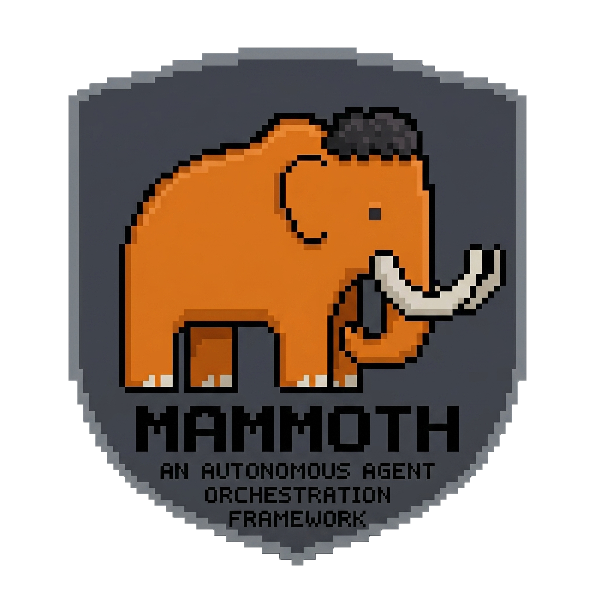

<div align="center">
  

  <h1>Mammoth CLI — Autonomous Coding Agent Framework</h1>
  
  <p><b>Autonomous coding agent framework. Multi-provider, multi-agent, memory-backed. Runs in your terminal.</b></p>

  
  
  
</div>

---

Mammoth CLI is an **autonomous coding agent framework** — not just a chat interface. It connects to any major LLM provider (DeepSeek, Claude, OpenAI, Groq, Ollama, OpenRouter), gives agents direct filesystem and shell access, and orchestrates specialized sub-agents that work in parallel on complex multi-step tasks. Includes a 4-tier memory system that learns across sessions, a workflow state machine with circuit breaker, and support for autonomous execution modes (Autopilot, Ralph, Ultrawork).

```bash
$ mammothcli

> Write a function that parses ISO 8601 dates with timezone offsets

# Mammoth reads your files, writes the code, runs the tests — all in your terminal.

```

## ✨ Features

* **Multi-provider** — DeepSeek, Anthropic Claude, OpenAI, Groq, Ollama, OpenRouter. Switch with `MAMMOTH_PROVIDER`.
* **Full tool suite** — Read, Write, Edit, Bash, Grep, Glob. LLM has direct filesystem and shell access.
* **Sub-agent system** — 9 specialized agent types (explorer, executor, code-reviewer, security-reviewer, debugger, architect, designer, writer, test-engineer). Spawned by the LLM automatically.
* **4-tier memory** — Working → Episodic → Semantic → Procedural. Learns across sessions via SQLite + FTS5.
* **Workflow engine** — State machine with circuit breaker. Autopilot, Ralph (quality-gated), Ultrawork (parallel) modes.
* **Slash commands** — Claude Code-compatible: `/help`, `/model`, `/doctor`, `/compact`, `/cost`, `/sessions`, `/resume`, `/config`, etc.
* **Session persistence** — Auto-saves conversations. Resume from any point.
* **MCP support** — Model Context Protocol for connecting external tool servers.

## 📦 Prerequisites

* [Bun](https://bun.sh) >= 1.0.0
* An API key for at least one supported provider

## 🚀 Install

```bash
# Clone the repository
git clone [https://github.com/georgegeorge2525/mammothcli.git](https://github.com/georgegeorge2525/mammothcli.git)
cd mammothcli

# Install dependencies
bun install

# Set your API key
echo 'DEEPSEEK_API_KEY=sk-...' > .env

# Run Mammoth
bun run start

```

### Global Install

```bash
bun install -g .
mammothcli

```

*Note: You can place your API key at `~/.mammoth/.env` for global access.*

## ⚙️ Provider Configuration

Set `MAMMOTH_PROVIDER` to choose your LLM backend:

| Provider | Environment Variable | Default Model |
| --- | --- | --- |
| `deepseek` *(default)* | `DEEPSEEK_API_KEY` | `deepseek-v4-pro` |
| `claude` | `ANTHROPIC_API_KEY` | `claude-sonnet-4-6` |
| `openai` | `OPENAI_API_KEY` | `gpt-4o` |
| `groq` | `GROQ_API_KEY` | `llama-4-maverick-128k` |
| `ollama` | *(none — local)* | `llama3.1` |
| `openrouter` | `OPENROUTER_API_KEY` | `openai/gpt-4o` |

**Examples:**

```bash
# Use Claude
MAMMOTH_PROVIDER=claude ANTHROPIC_API_KEY=sk-ant-... mammothcli

# Use local Ollama
MAMMOTH_PROVIDER=ollama mammothcli

```

## 🏗️ Architecture

```text
main-tui.tsx          Ink/React terminal UI
MammothLoop.ts        LLM conversation engine
AgentRunner.ts        Sub-agent spawner
Commands.ts           Slash command handler
ToolRegistry.ts       Tool registration + execution
services/
  providerClient.ts   Multi-provider API client
  apiClient.ts        DeepSeek native client (fast path)
  deepseekProtocol.ts DSML encode/decode
  memoryStore.ts      SQLite-backed memory
  engine.ts           Workflow orchestration
providers/
  deepseekProvider.ts Anthropic-compatible adapter for DeepSeek
  claudeProvider.ts   Native Anthropic Messages API adapter
  openaiProvider.ts   OpenAI Chat Completions adapter
  groqProvider.ts     Groq adapter
  ollamaProvider.ts   Ollama local adapter
  openrouterProvider.ts OpenRouter adapter
memory/               4-tier consolidation system
engine/               Workflow state machine + team orchestration

```

## ⌨️ Slash Commands

| Command | Description |
| --- | --- |
| `/help` | Show all commands |
| `/model [name]` | Show/switch model |
| `/clear` | Clear conversation |
| `/status` | Session stats |
| `/sessions` | List saved sessions |
| `/resume <id>` | Resume a session |
| `/cost` | API usage estimate |
| `/memory` | Memory system stats |
| `/consolidate` | Run memory consolidation |
| `/compact [N]` | Trim conversation history |
| `/doctor` | System diagnostics |
| `/config` | Show configuration |
| `/exit` | Quit |

## 🤖 Agent Types

| Agent | Tools | Use Case |
| --- | --- | --- |
| `explore` | Read, Grep, Glob | Codebase search, research |
| `executor` | Read, Write, Edit, Grep, Glob, Bash | Implementation |
| `code-reviewer` | Read, Grep, Glob | Code quality review |
| `security-reviewer` | Read, Grep, Glob | Security audit |
| `debugger` | Read, Grep, Glob, Bash | Root cause investigation |
| `architect` | Read, Write, Grep, Glob | Design + architecture docs |
| `designer` | Read, Write, Edit | UI/UX design |
| `writer` | Read, Write, Edit, Grep | Documentation |
| `test-engineer` | Read, Write, Bash | Test generation |

## 📄 License

Apache 2.0 — see [LICENSE](https://github.com/georgegeorge2525/mammothcli/blob/main/LICENSE).

## 🤝 Contributing

See [CONTRIBUTING.md](https://github.com/georgegeorge2525/mammothcli/blob/main/CONTRIBUTING.md). Issues and PRs are welcome!
